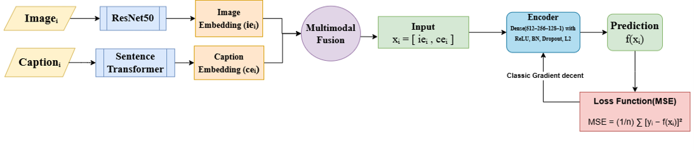
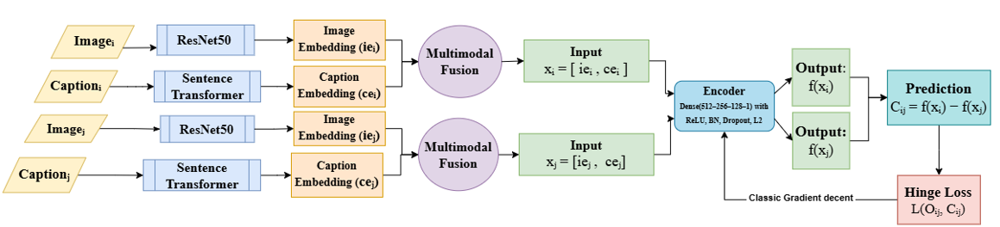

# Modeling Image-Caption Rating from Comparative Judgments

## Overview

This study investigates whether comparative learning can serve as an effective alternative to regression-based learning for image-caption rating.  

Instead of training directly on numeric human ratings, the comparative model learns from pairwise judgments indicating which of two image-caption pairs better match each other.

---

## Method

Each image-caption pair is encoded using a pretrained **ViLBERT** model, producing an image embedding and a caption embedding that are concatenated into a unified multimodal vector. Two models are trained on this representation:

- **Regression:** MSE loss on normalized human ratings
- **Comparative:** Hinge loss on pairwise preference labels `O_ij in {+1, -1}`

---


## Architecture

Both models share the same dual-encoder multimodal architecture.

### Regression Framework



### Comparative Learning Framework



---

## Dataset

Experiments are conducted on the **Validated Image Caption Rating (VICR) dataset**:

- 15,646 image-caption pairs  
- 68,217 human ratings  
- Ratings from 1 to 5  

Ratings are normalized to [0, 1] for training.  
An 80/20 train-test split is applied.

Sample data is included in the `data/` directory.

---

## Repository Structure
```text
comparative_image_caption/
├── src/                          # RQ1 and RQ2
│   ├── embeddings/
│   ├── embeddings_serialize.py
│   ├── regression.py
│   ├── compare.py
│   └── compare_same_image.py
├── code/                         # RQ3 human evaluation analysis
│   ├── checkpoint/
│   ├── comparative_acc.py
│   ├── comparative_agreement.py
│   ├── comparative_interrater_agreement.py
│   ├── compute_averages.py
│   └── task1_agreement_metrics.py
├── results/
│   ├── human_subject/
│   ├── image-caption_GT_VS_Human_Rating.xlsx
│   ├── Qualtrics_HumanEval_Results_Timing_vFinal.csv
│   ├── baseline.csv
│   ├── compare.csv
│   ├── compare_same_image.csv
└── README.md
```

### Execution Order

1. `embeddings_serialize.py` -- generate and serialize multimodal embeddings
2. `regression.py` -- train/evaluate regression baseline
3. `compare.py` -- train comparative model with hinge loss (RQ1)
4. `compare_same_image.py` -- same-image caption preference (RQ2)

---
## Reproducing Results

### Step 1: Generate Embeddings (required for all RQs)
```bash
python src/embeddings_serialize.py
```

Generates and serializes ViLBERT multimodal embeddings for all image-caption pairs. Output is saved to `src/embeddings/`.

### RQ1: Regression vs. Comparative Learning
```bash
python src/regression.py
python src/compare.py
```

Results (Pearson rho, Spearman r_s, Kendall tau_c) are saved to `results/baseline.csv` and `results/compare.csv`.

### RQ2: Same-Image Caption Preference
```bash
python src/compare_same_image.py
```

Evaluates which caption better describes a given image. Results are saved to `results/compare_same_image.csv`.

### RQ3: Human Evaluation


Raw annotation data from Qualtrics is in `results/Qualtrics_HumanEval_Results_Timing_vFinal.csv` and `results/image-caption_GT_VS_Human_Rating.xlsx`. To compute agreement metrics:
```bash
python code/task1_agreement_metrics.py
python code/comparative_interrater_agreement.py
python code/compute_averages.py
```
---
## Results

### RQ1: Regression vs. Comparative Learning

| Model | rho | r_s | tau_c |
|-------|-----|-----|-------|
| Narins et al. (2024) | -- | -- | 0.758 +/- 0.03 |
| Regression (ours) | 0.908 +/- 0.001 | 0.887 +/- 0.001 | 0.811 +/- 0.001 |
| Comparative (ours) | 0.874 +/- 0.008 | 0.880 +/- 0.002 | 0.800 +/- 0.002 |

### RQ2: Same-Image Caption Comparison (Accuracy)

| Model | Accuracy |
|-------|----------|
| Regression | 0.857 +/- 0.004 |
| Comparative | 0.846 +/- 0.009 |
| Same Image | 0.848 +/- 0.004 |

### RQ3: Human Inter-Rater Agreement

| Task | p_o | kappa |
|------|-----|-------|
| Direct Rating | 0.85 | 0.69 |
| Pairwise (different images) | 0.95 | 0.85 |
| Same-Image Comparison | 0.90 | 0.78 |

---


*Supported by NSF Grant No. 2245796.*
